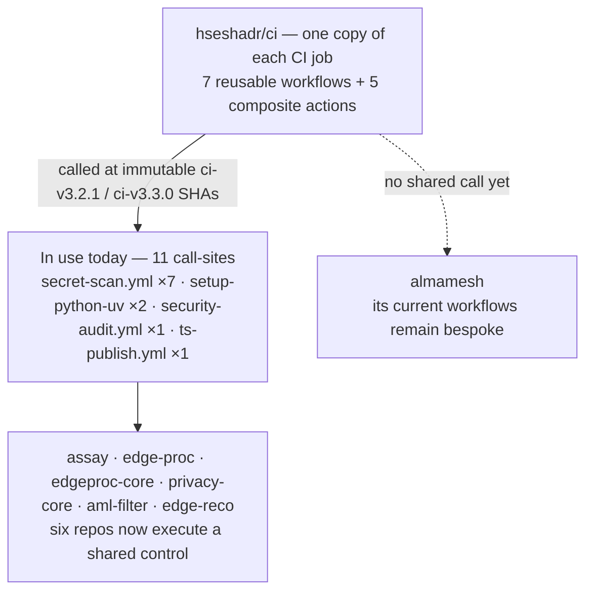

# hseshadr/ci — one home for the portfolio's CI/CD

**TL;DR — what this is.** Every repo in the edgeproc portfolio used to copy-paste the
same GitHub Actions setup: check out the code, install the toolchain, run the quality
gate, scan for leaked secrets, audit dependencies, deploy the site. Seven repos, seven
near-identical copies that drifted apart over time. This repo holds **one shared copy
of each**, and every other repo calls it in a few lines. Change CI once here; all seven
get the change.

**Why it works.** GitHub lets a workflow *call* a workflow that lives in another repo
(`uses: hseshadr/ci/...@<commit-sha>`), and lets a job *reuse* a bundle of steps called a
"composite action." So the shared logic lives here exactly once, and each repo keeps
only the one thing that is genuinely its own — its build command.

**Where that stands today.** Written is not the same as adopted, so the picture shows
both:



The dotted branch is the point of the [consumer-drift
guard](#consumer-drift-what-is-still-hand-rolled): publishing a shared control does
nothing until something calls it, so this repo measures the gap instead of assuming it
away. The counts below are that measurement.

**Why it exists.** "If we are manually changing things per project per repo, nothing is
standardized." One place to bump `actions/checkout`, one place to fix the gitleaks
pattern, one place that defines what "run the gate" means. No drift.

**Status.** Current release: **`ci-v3.3.0`** (commit
`8166345c9355dde54c12fa95d0457c4ea97d3e64`, 2026-08-25). Templates written and statically
validated — all 32 YAML files parse, and `actionlint` plus `zizmor` run in CI over the
workflows *and* over `examples/` (the examples need staging into a `.github/workflows/`
layout first, which `tests/lint-examples.sh` does; a plain repo-root scan reaches none of
them). Both are clean. Every example is additionally resolved against the repository it is
written for — see [Guards that run in CI](#guards-that-run-in-ci). The cross-repo [access
flip](#required-setup-read-this-first) is done, so callers resolve.

**Adopted in code by six repos — eleven call-sites.** Counted by the live consumer sweep on
2026-08-25:

| Brick | Call-sites | Where |
|---|---|---|
| `secret-scan.yml` (reusable workflow) | 7 | assay (×2), aml-filter, edge-proc, edge-reco, edgeproc-core, privacy-core |
| `setup-python-uv` (composite) | 2 | edge-proc, edgeproc-core |
| `security-audit.yml` (reusable workflow) | 1 | edge-proc |
| `ts-publish.yml` (reusable workflow) | 1 | privacy-core |
| the other 4 composites and 4 reusable workflows | **0** | nowhere |

`privacy-core` calls `ts-publish.yml` cross-repo; `edge-proc` and `edgeproc-core` compose
`setup-python-uv` inside their inline PyPI jobs (cross-repo PyPI is structurally
impossible — see the warning below). Eight existing calls still pin `ci-v3.2.1`; the new
EdgeReco scan and Assay's two full-history scans pin `ci-v3.3.0`, whose explicit
full-history mode is safe on tag pushes. `almamesh` currently has zero shared call-sites.

**The publish path is LIVE-VALIDATED end-to-end — two consumer releases have run
through it green (2026-07-22):**

- **npm, cross-repo:** privacy-core `v0.2.1 Publish (npm, OIDC)` —
  [run 29886074787](https://github.com/hseshadr/privacy-core/actions/runs/29886074787),
  SUCCESS — a consumer release executing this repo's `ts-publish.yml` at the pinned
  `ci-v2.0.3` SHA.
- **the calls-both pattern:** assay `v0.1.1 Publish (OIDC)` —
  [run 29887096259](https://github.com/hseshadr/assay/actions/runs/29887096259),
  SUCCESS on both jobs — `publish-pypi` inline (composing this repo's
  `setup-python-uv` composite at the pinned SHA) and `publish-npm` through cross-repo
  `ts-publish.yml`.

`secret-scan.yml` is live-validated too, and it is the first non-publish brick to get
there: aml-filter
[run 31051313153](https://github.com/hseshadr/aml-filter/actions/runs/31051313153) on
`main`, job `Secret scan / gitleaks` SUCCESS, at the `ci-v3.2.1` SHA.

Still unproven: the gate, frontend, and deploy templates have **no consumer runs** — those
repos still run their own inline jobs. A daily sweep counts exactly how much of that is
left: **17 hand-rolled controls across 6 of 7 consumer repositories** as of 2026-08-25 (see
[Consumer drift](#consumer-drift-what-is-still-hand-rolled)). And `edgeproc-core`'s six
older green publish runs (when it was still named `shared-libs-python`) predate the
migration *and* its PyPI trusted-publisher bootstrap, which is why the package never
resolved on PyPI (see [Publish verification](#publish-verification)).

Those six older green runs are also why both publish workflows **verify the release
against the registry** after uploading: the package they were releasing does not resolve
on PyPI. A green upload step and a published package are different facts, and until then
nothing here checked the second one. See [Publish verification](#publish-verification).

> **PyPI Trusted Publishing cannot be used through a cross-repo reusable workflow.**
> PyPI matches the OIDC token's `job_workflow_ref`, which for
> `uses: hseshadr/ci/.github/workflows/python-publish.yml@<sha>` names **this repo's
> file** — never the caller's `publish.yml` that the trusted publisher is registered
> against — so every cross-repo call ends in `invalid-publisher` (proven by assay's
> v0.1.1 run 29886472639, 2026-07-21). **Inline the pypi-publish job in your caller's
> own `publish.yml`** — ready-made copies of green callers live at
> [`examples/edge-proc/publish.yml`](./examples/edge-proc/publish.yml) (single package)
> and [`examples/assay/publish.yml`](./examples/assay/publish.yml) (PyPI + npm pair);
> `python-publish.yml` remains valid only for same-repo use or token-based flows and
> says so in its header. npm is unaffected: `ts-publish.yml` works cross-repo because
> npm matches the *caller's* workflow filename (proven by privacy-core run 29886074787).

Net: the npm publish workflow (`ts-publish.yml`) and the `setup-python-uv` composite have
executed green inside real consumer releases — the two runs above. `security-audit.yml`
now has an EdgeProc caller; its live run is not evidenced here. The gate, frontend, and
deploy templates have not yet had a consumer run. See the
[self-assessment](#self-assessment) for the scorecard.

---

## Adopt it with one caller

A repo's entire CI can become this (`.github/workflows/ci.yml`):

```yaml
name: CI
on: { push: { branches: [main] }, pull_request: }
permissions:
  contents: read
  pull-requests: read
jobs:
  gate:
    uses: hseshadr/ci/.github/workflows/python-gate.yml@8166345c9355dde54c12fa95d0457c4ea97d3e64 # ci-v3.3.0
    with: { sync-args: "--frozen --all-extras" }
  gitleaks:
    name: Secret scan
    uses: hseshadr/ci/.github/workflows/secret-scan.yml@8166345c9355dde54c12fa95d0457c4ea97d3e64 # ci-v3.3.0
```

That is the *whole file*, and it is copy-pasteable as written: the SHA above **is**
`ci-v3.3.0`, the current release. `gate` runs the repo's `poe gate` (lint, format-check,
types, complexity, tests + coverage floor); `gitleaks` scans **the commits this push or
pull request introduced** — not the repository's history. Sweeping history needs a second
caller on a `schedule`; see [What the secret scan actually
covers](#what-the-secret-scan-actually-covers). The `name: Secret scan` is not decoration:
without it the check reports as `gitleaks / gitleaks`, which is the wrong context for
branch protection — see the next section. Ready-to-copy callers for all seven consumer
repos live in [`examples/`](./examples), carrying the same SHA. Every `hseshadr/ci/...` ref must be a
full commit SHA, never a moving `@ci-vN` tag; see
[Version pinning](#version-pinning-full-commit-shas) for why.

### What the secret scan actually covers

**A green secret scan is not evidence unless you know how many commits it read.**

`gitleaks-action` derives its scan range from the **event**, not from `fetch-depth`
(`gitleaks-action@e0c47f4`, `src/gitleaks.js:103-115` and `src/index.js:176`):

| Event | What the action passes to gitleaks | What gets scanned |
|---|---|---|
| `push`, `pull_request` | `--log-opts=--no-merges --first-parent BASE^..HEAD` | **only the commits that event introduced** |
| `schedule`, `workflow_dispatch` | nothing | **every commit in the repository** |

`fetch-depth: 0` is still mandatory — it makes `BASE^` resolvable and makes every commit
available to the explicit full-history pass — but on its own it does **not** widen the
action's event-derived range.

Measured on this repository, through `secret-scan.yml` itself:

| Event | Run | Commits scanned | Verdict |
|---|---|---|---|
| `schedule` | [30793713570](https://github.com/hseshadr/ci/actions/runs/30793713570) | **41** | No leaks detected |
| `pull_request` | [30978634362](https://github.com/hseshadr/ci/actions/runs/30978634362) | **1** | No leaks detected |
| `push` to `main` | [31051347230](https://github.com/hseshadr/ci/actions/runs/31051347230) | **0** | No leaks detected |

A push whose base is already an ancestor of head scans **zero commits** and still reports
success. Until 2026-08-06 this file claimed the opposite — "gitleaks over the FULL git
history", "a credential committed five commits ago is exactly as leaked as one committed
at HEAD" — and every consumer's only caller was on `push`/`pull_request`. So no repo's
pre-existing history had ever been scanned by CI.

**The caller owns when a sweep runs; the shared workflow owns how.** A `workflow_call`
workflow cannot carry its own `schedule:`. Every consumer already has a
`security-audit.yml` on a weekly cron, so add a second caller job there:

```yaml
# security-audit.yml  —  on: schedule
jobs:
  gitleaks:
    name: Secret scan
    uses: hseshadr/ci/.github/workflows/secret-scan.yml@8166345c9355dde54c12fa95d0457c4ea97d3e64 # ci-v3.3.0
    with:
      full-history: true
```

`full-history: true` runs `gitleaks git --log-opts=--all` after the action's event-range
scan. That works on schedules, manual runs, and tag pushes whose action-derived range can
be empty. It defaults to `false`, so ordinary push/PR callers keep their fast incremental
scan.

Findings remain only in redacted job logs: PR comments, job summaries, and SARIF artifact
uploads are disabled. This matters precisely on failure—a secret scanner must not turn a
detected credential into a downloadable artifact.

`tests/security-policy.sh` refuses an `examples/` tree where a repo calls
`secret-scan.yml` but never from a scheduled workflow, and executes the coverage step
under both event families rather than grepping for its error string.

### Adopting a reusable workflow renames its check run

**Read this before converging a repo that has branch protection.** GitHub names a
reusable workflow's check run `<caller job name> / <called job name>`, not after the
caller job alone. So replacing an inline job called `gitleaks` with

```yaml
  gitleaks:
    name: Secret scan
    uses: hseshadr/ci/.github/workflows/secret-scan.yml@<sha> # ci-v3.3.0
```

produces a check named **`Secret scan / gitleaks`**. The old `gitleaks` context stops
reporting entirely. If it was a *required* status check, every PR then blocks on a context
that can never arrive — the repo looks broken and the obvious fix looks like "revert the
adoption". This repo's own dogfood job shows the effect: its check run is
`Secret scan (own brick) / gitleaks`.

Update branch protection in the same move:

```bash
gh api repos/hseshadr/<repo>/branches/main/protection/required_status_checks \
  --jq '.checks'          # see the current contexts first
```

This is a real cost of adoption and it is worth naming plainly, because it is paid by the
person converging and invisible to the person who published the brick. It is one reason a
hand-rolled copy keeps winning: inlining never renames anything.

**It applies to every caller job, not just the secret scan.** The quickstart's `gate:` job
is unnamed, so it reports as `gate / gate`. Name it after whatever context your branch
protection already requires.

| Brick | Check context an adopter gets | Observed in a real run? |
|---|---|---|
| `secret-scan.yml` called by `gitleaks:` with `name: Secret scan` | `Secret scan / gitleaks` | ✅ aml-filter [run 31051313153](https://github.com/hseshadr/aml-filter/actions/runs/31051313153) |
| `secret-scan.yml` called by `gitleaks:` with **no** `name:` | `gitleaks / gitleaks` | ✅ this is the mismatch that reached five repos |
| `secret-scan.yml` called by `secret-scan:` with `name: Secret scan (own brick)` | `Secret scan (own brick) / gitleaks` | ✅ this repo's own CI, and a required context on `main` |
| `python-gate.yml` called by an unnamed `gate:` job | `gate / gate` | ⚠️ **unverified** — no consumer calls `python-gate.yml` yet, so this string is derived from the rule above and has never been emitted by a run |

The last row is deliberately marked rather than stated. Documenting an unobserved context
name as fact is precisely how the `gitleaks` mismatch got copied into five repos.

### Our releases are `ci-vX.Y.Z`, and that can trip a consumer's own pin guard

Third-party actions tag `vN`; this repo tags `ci-vN.N.N`, so the trailing comment on a
first-party pin reads `# ci-v3.3.0`, not `# v3.3.0`. A consumer that lints its own pinned
`uses:` comments with a `^v\d` regex will **reject a correct `hseshadr/ci` pin** — and the
only way to satisfy that regex is to write a comment naming a tag that does not exist.

This is not hypothetical: it is what turned [aml-filter#93](https://github.com/hseshadr/aml-filter/pull/93)
red on its first run, on the repo's own supply-chain test. The fix belongs in the guard,
and it should *tighten*, not loosen — key the expected scheme off the ref, so neither
naming convention is accepted for the other:

```ts
const expected = target.startsWith("hseshadr/ci/") ? /^ci-v\d/ : /^v\d/;
```

If you maintain a consumer with a pin-comment guard, expect to make this edit as part of
adopting anything from here.

### Before → after (a real consumer)

edge-proc's hand-rolled `ci.yml` + `security-audit.yml` was **~89 lines** of the same
five steps every Python repo repeats:

```yaml
# BEFORE — .github/workflows/ci.yml (representative; ~49 lines, and a ~40-line
# security-audit.yml just like it)
name: CI
on: { push: { branches: [main] }, pull_request: }
jobs:
  gate:
    runs-on: ubuntu-latest
    steps:
      - uses: actions/checkout@v5
      - uses: astral-sh/setup-uv@v8.1.0
        with: { enable-cache: true }
      - run: uv python install 3.13
      - run: uv sync --frozen --all-extras
      - run: uv run poe gate
  gitleaks:
    runs-on: ubuntu-latest
    steps:
      - uses: actions/checkout@v5
        with: { fetch-depth: 0 }
      - uses: gitleaks/gitleaks-action@v2
        env: { GITHUB_TOKEN: "${{ secrets.GITHUB_TOKEN }}" }
  # …then a whole separate security-audit.yml repeating the uv setup for pip-audit…
```

**After** — the small `ci.yml` above plus a 10-line `security-audit.yml`. Across the
whole portfolio the templatable workflows shrink from **~598 lines to ~135** (about a
77% cut), and the action-version drift the survey found (edge-reco on `checkout@v7`
while the others were on `@v5`) collapses to one pinned set here.

---

## Which brick do I want?

A **reusable workflow** replaces a whole job (`uses:` at job level). A **composite action**
replaces a few steps *inside* a job you still own (`uses:` at step level). "Adopted by" is
what actually calls it in a consumer repo today — a blank means nobody does yet, not that
it is broken.

| Brick | Use it when | Adopted by |
|---|---|---|
| `python-gate.yml` (workflow) | your Python repo runs `uv run poe gate` | — |
| `frontend-gate.yml` (workflow) | your JS repo runs `pnpm gate`, optionally with Playwright | — |
| `secret-scan.yml` (workflow) | any repo — gitleaks over the event range by default; `full-history: true` runs an explicit `--all` sweep | aml-filter |
| `security-audit.yml` (workflow) | you want `pip-audit` and/or `pnpm audit` (at least one must be on) | — |
| `cloudflare-pages-deploy.yml` (workflow) | you deploy a built site to Cloudflare Pages | — |
| `ts-publish.yml` (workflow) | you release an npm package from a `v*` tag, token-free via OIDC | assay (×2), privacy-core |
| `python-publish.yml` (workflow) | **same-repo only.** PyPI Trusted Publishing cannot match a cross-repo call — copy the inline job from `examples/edge-proc/publish.yml` instead | — |
| `setup-python-uv` (composite) | your own job needs uv + a pinned Python + a locked `uv sync` | assay, edge-proc, edgeproc-core |
| `setup-pnpm` (composite) | your own job needs pnpm + Node with a warm store cache | — |
| `setup-playwright` (composite) | your own job needs cached Playwright browsers | — |
| `restore-model-cache` (composite) | your own job needs large model weights cached between runs | — |
| `pages-deploy-dist` (composite) | your build is bespoke but you want the shared, header-hardened `wrangler pages deploy` | — |

---

## What's in here (maps 1:1 to the tree)

```
.github/
  workflows/                      # reusable workflows plus this repo's own gate
    ci.yml                        #   validates this repo's CI security policy
    python-gate.yml               #   checkout → setup → uv run poe gate → (opt) codecov
    frontend-gate.yml             #   checkout → pnpm setup → (opt) Playwright → pnpm gate
    secret-scan.yml               #   gitleaks over the calling event's commit range
    security-audit.yml            #   pip-audit and/or pnpm audit (each bool-gated)
    cloudflare-pages-deploy.yml   #   preflight → build → wrangler pages deploy
    python-publish.yml            #   gate → uv build → PyPI via OIDC → verify on PyPI (SAME-REPO only)
    ts-publish.yml                #   gate → build → npm via OIDC → verify on npm
    consumer-drift.yml            #   daily sweep: which consumers still hand-roll a control
  actions/                        # composite actions — a bundle of steps you `uses:` INSIDE a job
    setup-python-uv/              #   install uv (cached) + pin Python + (opt) uv sync
    setup-pnpm/                   #   pnpm + Node (pnpm cache) + (opt) install
    setup-playwright/             #   cache + install Playwright browsers
    restore-model-cache/          #   cache self-hosted model weights + fetch on miss
    pages-deploy-dist/            #   baseline headers + shared wrangler deploy
  dependabot.yml                  # bumps THIS repo's action pins; consumers re-pin the new SHA
examples/                         # copy-paste caller workflows, one folder per consumer repo
tests/
  security-policy.sh              # YAML + pins + pin PROVENANCE + permissions + injection
  lint-examples.sh                # stages examples/ into a real workflow layout, then
                                  #   actionlint + zizmor them (neither tool reaches them
                                  #   otherwise), then runs example-fidelity.sh
  example-fidelity.sh             # does every example still resolve against the repo it serves?
  example-fidelity-cases.sh       #   both-polarity fixtures for that checker
  consumer-drift.sh               # which consumers still hand-roll a control we publish?
  consumer-drift-cases.sh         #   both-polarity fixtures for the drift classifier
  consumer-drift-allowlist.txt    #   the convergence backlog: known drift, each with a reason
  lineage-guard-cases.sh          # drives the lineage guard against synthetic repos to prove
                                  #   its release-commit exemption stays one release wide
  lib/
    scan-run-interpolation.rb     #   finds attacker-controllable ${{ }} inside run: blocks
    scan-publish-provenance.rb    #   proves every publish path is signed
    scan-caller-permissions.rb    #   proves no caller grants a reusable workflow LESS
                                  #   than it needs (that run cannot start, and a run
                                  #   that cannot start emits ZERO check runs)
    workflow-run-pin.rb           #   parses fork-deploy gates into a boolean AST
    classify-workflow.rb          #   classifies a consumer workflow by behavior
    example-references.rb         #   resolves an example's references inside a consumer repo
    first-party-lineage.sh        #   the lineage/currency guard, shared by two suites above
.ruby-version                     # 3.4.10 — the Ruby the guards above are run on, in CI too
CHANGELOG.md
```

**Reusable workflow vs composite action — the one distinction that explains everything.**
A *reusable workflow* is an entire job on its own fresh runner: great when the whole job
is shared, but it cannot accept extra `uses:` steps injected by the caller. A *composite
action* runs *inside* the caller's own job, so the caller can wrap its own cache/build
steps around it. That single fact decides what became a workflow and what became a
composite (details below).

---

## Under the hood (for developers)

### Reusable workflows

| Workflow | Key inputs | Secrets | What the job runs |
|---|---|---|---|
| `python-gate.yml` | `working-directory` `.`, `python-version` `3.13`, `sync-args` `--locked` (must carry `--frozen`/`--locked`; opt out only via `--allow-unlocked`), `gate-task` `gate`, `upload-coverage` `false`, `coverage-file` `coverage.xml` | `CODECOV_TOKEN` (optional) | checkout → **setup-python-uv** → `uv run poe <gate-task>` → optional Codecov upload |
| `frontend-gate.yml` | `working-directory` `.`, `package-json-file`, `node-version` `24` / `node-version-file`, `cache-dependency-path` `pnpm-lock.yaml`, `install-args` `--frozen-lockfile`, `gate-command` `pnpm gate`, `install-playwright` `false`, `playwright-browsers` `chromium` | — | checkout → **setup-pnpm** → optional **setup-playwright** → `gate-command` |
| `secret-scan.yml` | `runs-on`, `full-history` `false` | uses `GITHUB_TOKEN` | checkout `fetch-depth:0` → `gitleaks-action` over the calling event's commit range (whole history only on `schedule`/`workflow_dispatch`) → report what was covered |
| `security-audit.yml` | `run-python-audit` `false`, `run-pnpm-audit` `false`, `python-working-directory` `.`, allowlisted `pip-audit-export-args`, `frontend-working-directory` `frontend`, `pnpm-audit-level` `low` | — | `pip-audit` job (validated export args → `pip-audit`) and/or `pnpm-audit` job (validated severity) |
| `cloudflare-pages-deploy.yml` | `project-name`*, `dist-dir`*, `build-command`*, `install-working-directory` `.`, `pre-build-run` `""`, `node-version(-file)`, `cache-dependency-path`, `branch` `main`, `wrangler-version` `4.110.0` | `CLOUDFLARE_API_TOKEN`*, `CLOUDFLARE_ACCOUNT_ID`* | preflight (skip-clean if secrets absent) → guard → **setup-pnpm** → pre-build → build → **pages-deploy-dist** |
| `python-publish.yml` (**same-repo only** — cross-repo consumers inline it) | `working-directory` `.`, `python-version` `3.13`, `sync-args` `--locked`, `gate-task` `gate`, `run-gate` `true`, `packages-dir` `dist`, `attestations` `true`, `environment` `""` | — (OIDC, token-free) | checkout → **setup-python-uv** → reuse gate → `uv build` → `gh-action-pypi-publish` (PyPI **OIDC Trusted Publishing**) |
| `ts-publish.yml` | `working-directory` `.`, `node-version` `24`, `gate-command` `pnpm gate`, `build-command` `pnpm build`, `run-gate` `true`, `provenance` `true` (a **private** caller must pass `false` explicitly), `registry-url` `…npmjs.org`, `environment` `""` | `NPM_READ_TOKEN` (optional, private-dep installs only) | checkout → **setup-node** (registry for OIDC) → **setup-pnpm** → gate → build → `npm publish` (npm **OIDC Trusted Publishing**) |

\* required. Every other input has a documented default — no version or path is a magic
literal buried in a step; the gate's coverage floor is deliberately **not** an input (it
lives in each repo's `pytest --cov-fail-under`, so CI can never pass a looser bar than local).

**OIDC publishing (`python-publish` / `ts-publish`) — no stored token.** Both publish
workflows carry `on: workflow_call` and are pinned by callers at a full commit SHA (a
moving tag here would be a supply-chain hole — see [Version
pinning](#version-pinning-full-commit-shas)); the caller owns
the `on: push: tags: ['v*']` trigger and grants `id-token: write` on its publish job (the
top-level stays read-only, as the security policy requires). The build and the OIDC identity
run in one job, so nothing needs a `twine`/`NODE_AUTH_TOKEN` write token. Two one-time human
bootstraps remain, both outside CI: registering the trusted publisher on PyPI/npm once per
package, and — because npm has **no** "pending publisher" — a single token/OTP first-publish
for each brand-new npm name before OIDC can take over.

**Signing is the default; not signing is what you ask for.** `ts-publish`'s `provenance`
and `python-publish`'s `attestations` both default **true** — `provenance` since
`ci-v3.0.0` — and
`tests/security-policy.sh` **rejects** any workflow or example that publishes without
them — a PyPI upload missing `attestations: true`, an inline `npm`/`pnpm`/`yarn publish`
missing `--provenance` (in a workflow *or* a composite action), a `ts-publish` caller
setting `provenance: false`, a `python-publish` caller setting `attestations: false`, or a
publishing job missing `id-token: write`. `provenance` defaulted false until 2026-07-25 as a private-repo
hangover, and that was a silent trap: `npm publish --provenance` writes a public
transparency-log entry and so requires a **public** source repo, but a caller who simply
forgot the input got an unsigned release and a perfectly green run. A **private** caller
must now pass `provenance: false` explicitly. Unchanged: each `package.json`
`repository.url` must exactly match its GitHub repo or npm OIDC fails. Ready callers:
[`examples/privacy-core/publish.yml`](./examples/privacy-core/publish.yml) (npm,
cross-repo — live-proven by run 30173462035, which put a SLSA v1 provenance attestation
on `@edgeproc/privacy-core` 0.2.2),
[`examples/edge-proc/publish.yml`](./examples/edge-proc/publish.yml) and
[`examples/edgeproc-core/publish.yml`](./examples/edgeproc-core/publish.yml)
(inline PyPI job — the only shape PyPI Trusted Publishing permits from another repo), and
[`examples/assay/publish.yml`](./examples/assay/publish.yml) (both at once — live-proven
by run 29887096259).

### Composite actions

| Action | Key inputs | What it runs |
|---|---|---|
| `setup-python-uv` | validated `python-version` `3.13`, allowlisted `sync-args` `--locked` (locked by default; explicit `--allow-unlocked` to opt out), `working-directory` `.`, `run-sync` `true` | install uv (cached) → `uv python install` → optional `uv sync` |
| `setup-pnpm` | `package-json-file`, `node-version` `24` / `node-version-file`, `cache-dependency-path`, allowlisted `install-args` `--frozen-lockfile`, `working-directory` `.`, `install` `true` | `pnpm/action-setup` → `setup-node` (pnpm cache) → optional `pnpm install` |
| `setup-playwright` | `cache-key`*, allowlisted `browsers` `chromium`, `working-directory` `.` | cache `~/.cache/ms-playwright` → install browsers (miss) or OS deps only (hit) |
| `restore-model-cache` | `cache-path`*, `cache-key`*, `fetch-command`*, `working-directory` `.`, `always-fetch` `false` | cache the weights dir → run `fetch-command` only on a cache miss |
| `pages-deploy-dist` | `project-name`*, `dist-dir`*, `cloudflare-api-token`*, `cloudflare-account-id`*, `branch` `main`, `wrangler-version` `4.110.0` | add a conservative `_headers` baseline when absent → `npx wrangler pages deploy` |

Every composite assumes the caller **already ran `actions/checkout`** (a composite can't
assume a working tree). Composites can't read the `secrets` context, so
`pages-deploy-dist` takes the two Cloudflare secrets as inputs.

The Pages baseline sets anti-framing, MIME-sniffing, referrer, browser-feature,
HSTS, and narrow CSP controls. If a build already contains `_headers`, the action
preserves it byte-for-byte so an application can own a stricter or intentionally
different policy. Cloudflare applies `_headers` to static asset responses; Pages
Functions must set equivalent headers in their own response code.

**Composition, not duplication.** The reusable workflows don't re-implement setup — they
*compose the same composites the bespoke jobs use*. `python-gate` composes
`setup-python-uv`; `frontend-gate` composes `setup-pnpm` + `setup-playwright`;
`security-audit` composes both (with sync/install switched off); `cloudflare-pages-deploy`
composes `setup-pnpm` + `pages-deploy-dist`. So the uv pin, the pnpm/Node pins, the
Playwright cache pattern, and the wrangler invocation each live in exactly one file.

### Version pinning: full commit SHAs

Consumers pin a **full 40-character commit SHA**, with the release name in a trailing
comment so Dependabot can bump it:

```yaml
uses: hseshadr/ci/.github/workflows/python-gate.yml@8166345c9355dde54c12fa95d0457c4ea97d3e64 # ci-v3.3.0
```

Moving tags are **not** a supported pin, not even for first-party refs.
`tests/security-policy.sh` fails the build on any `uses: hseshadr/ci/...@ci-vN`, in the
workflows this repo runs and in the examples it publishes.

**Why the stricter rule.** These refs used to ride the moving `@ci-v1` tag behind a
`zizmor` suppression, and that left a real hole: a consumer that pinned
`python-publish.yml` to a SHA still had the *nested* `setup-python-uv@ci-v1` resolved
through a mutable tag at run time, so the pin was only skin-deep. The publish workflows
run with `id-token: write` for OIDC Trusted Publishing, so moving `ci-v1` would have
reached PyPI and npm across every consumer. Pinning the whole chain closes it.

`ci-vX.Y.Z` and the moving `ci-vN` pointers still exist as human-readable release
*names* — read them in [`CHANGELOG.md`](./CHANGELOG.md) to find the SHA you want. They
are not what you put after the `@`. Add a Dependabot `github-actions` entry in each
consumer so these pinned SHAs are tracked like any other dependency; upgrading is then a
deliberate, reviewable commit rather than a tag someone else can move under you.

### Immutable third-party action pins

Every executable third-party `uses:` reference is pinned to the full 40-character
commit behind the selected release. The trailing comment must name the **exact** version
that SHA is, never a floating major: a `# v6` comment goes silently wrong the moment
upstream moves the `v6` tag, and the comment is what a human reads to decide whether the
pin is current. Commit `ae644d7` fixed exactly that. Dependabot updates both the SHA and
its label.

Two actions are pinned at different versions on different surfaces — `.github/` runs the
newer one, `examples/` still shows the release consumers copied. Both are listed.

| Action | Release comment | Pin policy |
|---|---|---|
| `actions/checkout` | `# v7.0.1` (`.github/`), `# v7.0.0` (`examples/`) | full commit SHA |
| `actions/setup-node` | `# v6.4.0` (setup-pnpm composite), `# v7.0.0` (ts-publish) | full commit SHA |
| `actions/cache` | `# v6.1.0` | full commit SHA |
| `pnpm/action-setup` | `# v6.0.9` | full commit SHA |
| `astral-sh/setup-uv` | `# v9.0.0` | full commit SHA |
| `codecov/codecov-action` | `# v7.0.0` | full commit SHA |
| `gitleaks/gitleaks-action` | `# v3.0.0` | full commit SHA |
| `ruby/setup-ruby` | `# v1.321.0` | full commit SHA |

First-party `hseshadr/ci/...` references get the **same** treatment — full commit SHA,
no exceptions. First-party is not a synonym for trustworthy: a moving tag is a moving
tag regardless of who owns it, and these run in workflows that hold `id-token: write`.
The self-references can't be relative action paths (`./.github/actions/...`), because a
reusable workflow executes against the *caller's* checkout, where that path would
resolve to the consumer repository instead of this one — so a SHA is the only immutable
form available, and `validate_first_party_pins` in `tests/security-policy.sh` enforces
it with no carve-out.

That last claim is load-bearing enough that we measured it rather than trusting it.
A throwaway probe put an identically-pathed composite in both repositories, with
different markers, and had a consumer call a reusable workflow here that referenced it
as `./.github/actions/probe-origin`. [Run
29838733369](https://github.com/hseshadr/privacy-core/actions/runs/29838733369) printed
the **consumer's** marker:

```
PROBE_RESULT=RESOLVED_TO_CONSUMER_REPO_hseshadr_privacy_core
action_path=/home/runner/work/privacy-core/privacy-core/./.github/actions/probe-origin
```

and the no-checkout control failed with `Can't find 'action.yml' … under
'/home/runner/work/privacy-core/privacy-core/.github/actions/probe-origin'. Did you
forget to run actions/checkout before running your local action?`. So `./` is
workspace-relative, not repository-relative: it would silently run whatever the consumer
happens to have at that path, or nothing at all. It is not an option here.

**A pin-shape check is not enough, which we learned the expensive way.** Every ref can be
a valid 40-hex SHA and the tree can still be wrong: for a while every file in `examples/`
pointed at `ci-v2.0.0` (`36bf999`), a real commit and a real ancestor — whose reusable
workflows still contained nested `@ci-v1` moving tags. The shape check passed, so a
consumer following this repo's own documented path inherited the exact hole the pin was
supposed to close. `validate_first_party_release_lineage` now asserts *provenance*
instead: every `hseshadr/ci` SHA must exist in this repository, be an ancestor of the
newest `ci-vX.Y.Z` tag, and **be** that tag. A superseded-but-valid release now fails the
build.

### The release-commit bootstrap

There is exactly one state that rule cannot express, and it is forced by arithmetic
rather than by taste: **a commit cannot contain its own SHA.** Our self-references are
absolute SHAs (see above — `./` is not available), so at the moment we tag a release,
every self-reference inside the tagged tree still names the *previous* release. There is
no value we could have written that would name the new one.

Under a strict "must be the newest tag" rule the tagged commit therefore failed its own
guard. That was not hypothetical: dispatching CI at `ci-v2.0.2`
([run 29839090693](https://github.com/hseshadr/ci/actions/runs/29839090693)) went red
with `first-party ref 9e8cf2e… is a superseded release, not ci-v2.0.2` across all 21
files — a release that could not re-run its own pipeline green.

So the guard now allows one narrow thing:

| Where the guard runs | What a first-party ref may name |
|---|---|
| The newest tag's own commit | that tag, **or** the release immediately before it |
| Any other commit | that tag, and nothing else |

Ancestry and existence are still checked everywhere, with no carve-out; only the
*currency* clause relaxes, only at the tagged commit, and only by one release.

**The residual gap, stated plainly.** A consumer pinning `ci-vX.Y.Z` gets that release's
reusable workflows, but the composite actions nested *inside* those workflows come from
`ci-vX.Y.(Z-1)`. Those nested refs are still immutable released SHAs — nothing moves
under anyone — but they are one generation behind. When a release changes a composite's
behavior, that change reaches consumers only at the following release. The CHANGELOG
marks any release whose composites changed, and the re-pin commit on `main` immediately
after each tag is what closes the gap for anyone tracking `main`.

Because this repository's own history cannot produce a two-releases-behind tagged commit
on demand, the exemption's *scope* is asserted against synthetic repositories in
`tests/lineage-guard-cases.sh` — ten cases, **seven of which must keep failing**. It runs
in CI as its own step, and `validate_self_ci` fails the build if that step is ever removed.

### Publish verification

Both publish workflows ask the registry whether the release actually landed, instead of
trusting the upload step's exit code. After `pypa/gh-action-pypi-publish` (or
`npm publish`), the job derives the exact `name` + `version` it just shipped — from the
sdist filename for PyPI, from `npm pkg get` for npm — and polls
`https://pypi.org/pypi/<name>/<version>/json` or `npm view <name>@<version>`. Fourteen
attempts on a 5/10/15/30/60s backoff — 600 seconds of sleep, about 3× the slowest
propagation actually measured. Propagation delay gets retries; a timeout is a **failure**,
never a pass. (The bound was six attempts ten seconds apart until `ci-v3.2.1`, which is
the release that widened it after a real publish lost that race.)

This exists because a green upload and a published package turned out to be different
facts. `edgeproc-core` (then named `shared-libs-python`) collected six green
`Publish (PyPI, OIDC)` runs — one named `Release v0.2.0` — on top of a package that does
not resolve on PyPI. The trusted-publisher bootstrap had never been completed, and no check
in the pipeline was capable of noticing. The failure message says so directly and names
that bootstrap as the first thing to check.

### Guards that run in CI

Three suites run on every push and pull request, plus a daily sweep. Each answers a
different question, and each is itself tested in **both** polarities — a guard that has
never been shown saying NO is decoration.

| Suite | Question it answers | Runs |
|---|---|---|
| `tests/security-policy.sh` | is *this repo's* YAML safe — pins, pin provenance, permissions (including [callers that under-grant](#a-caller-that-under-grants-does-not-go-red-it-goes-absent)), shell injection, signed publishes? | push / PR / weekly |
| `tests/lint-examples.sh` | do the files consumers copy pass `actionlint` + `zizmor`, and do they still resolve? | push / PR / weekly |
| `tests/consumer-drift.sh` | is a consumer hand-rolling a control we already publish? | daily + PR |

Everything above is Ruby or Bash, and `.ruby-version` (3.4.10) pins the Ruby they run on —
in CI too, via `ruby/setup-ruby`. Guards that decide whether a workflow is safe should not
run on whatever Ruby a runner image happens to ship.

#### A caller that under-grants does not go red, it goes ABSENT

If a caller job grants a reusable workflow less than that workflow declares it needs,
GitHub refuses the run before any job starts:

```
requesting 'pull-requests: read', but is only allowed 'pull-requests: none'
```

The conclusion is `startup_failure`, and it emits **zero check runs**. Not one red check.
Nothing. Measured here on
[run 31127046921](https://github.com/hseshadr/ci/actions/runs/31127046921): `jobs: 0`, and
the check-runs API for that head SHA listed only the checks from *other* workflows.
`Security policy` and `Secret scan (own brick) / gitleaks` were not failing — they were not
there.

That is the dangerous part. Branch protection cannot distinguish a required check that is
**missing** from one that has not reported **yet**, so the PR sits pending instead of going
red, and a gate you made un-skippable is skipped in silence.

The trap that produces it: **a job-level `permissions:` block replaces the top-level one, it
does not add to it.** Restating `contents: read` on a job looks harmless and silently drops
every other scope to `none`.

```yaml
permissions:
  contents: read          # workflow level

jobs:
  sweep:
    permissions:
      contents: read      # looks like a restatement — it is a REPLACEMENT.
      pull-requests: read # without this line the run never starts.
    uses: ./.github/workflows/secret-scan.yml
```

`validate_caller_permission_sufficiency` in `tests/security-policy.sh` compares every caller
in `.github/workflows/` **and** `examples/` against the callee it names, statically. It has
to be static: there is no run to read, because the failure *is* the absence of a run. It
also asserts it resolved at least 20 caller→callee pairs, so a scanner that quietly stopped
resolving refs cannot look like a clean tree.

#### Example fidelity: do the examples still fit their repos?

`actionlint` and `zizmor` check an example's YAML shape and its workflow security. Neither
opens the repository the example is *for*, so both stayed green while
`examples/edge-reco/ci.yml` named `frontend/.node-version` — a file edge-reco has never
had, and one `actions/setup-node` hard-fails on. That example was red as drafted and the
gate shipped it. Since every convergence in this portfolio starts with "copy the example",
an unchecked example is an unchecked migration.

`tests/example-fidelity.sh` (with `tests/lib/example-references.rb`) closes that. For each
example it resolves, against the consumer repository's **committed** default branch:

- every file and directory path the example names,
- every `package.json` script and node script it invokes,
- every `poe` task it runs,
- every `hseshadr/ci` brick it calls — **and every input name it passes to that brick.**

Each reference gets one of three statuses: **OK**, **MISSING**, or **UNVERIFIABLE**.
UNVERIFIABLE — no clone of that consumer, or too few references resolved to mean anything
— is *never* a pass; it exits `2`, so "could not verify" can never be mistaken for
"verified". Run it:

```bash
tests/example-fidelity.sh            # resolves against your ~/dev/oss clones
tests/example-fidelity.sh --clone    # shallow-clones the consumers (what CI does)
```

It is wired into `tests/lint-examples.sh`, so CI runs it, and
`tests/example-fidelity-cases.sh` drives it against synthetic examples to prove it can
still fail. On its first run it found **8 broken references that actionlint and zizmor had
both passed.**

#### Consumer drift: what is still hand-rolled

`tests/consumer-drift.sh` walks every consumer's workflows over the GitHub API, classifies
each one by *behavior* (`tests/lib/classify-workflow.rb`), and reports any control a
consumer hand-rolls that this repo already publishes. It exists because five consumers each
carried their own Cloudflare Pages deploy while a reusable one sat here, and one of those
five copies drifted into a fork-PR deploy hole. The bug was in the copy, not in the shared
workflow — and nothing was comparing the two.

Today's count: **17 hand-rolled controls across 6 of 7 repositories** (almamesh 4,
aml-filter 5, edge-proc 3, edge-reco 1, edgeproc-core 2, privacy-core 2; assay 0). They are listed
individually in `tests/consumer-drift-allowlist.txt`, which is a **convergence backlog, not
an exemption list**: every entry requires a written reason, deleting one is free, and *new*
drift with no entry fails the build.

One entry is now ready to converge: `edge-proc/publish.yml` still runs an explicit
`gitleaks git --log-opts=--all` tag-release preflight because the action-derived tag range
can inspect zero commits. `secret-scan.yml@ci-v3.3.0` now proves that same full-history
behavior through `full-history: true`; the consumer has not adopted it yet.

#### It caught one, and the cause was partly this repo

On 2026-08-02 the scheduled sweep went red:
[`30 … 29 allowlisted; 1 new`](https://github.com/hseshadr/ci/actions/runs/30739082151).
The 08-01 run had read `29 … 0 new`, so the window is a day.

The new control was `aml-filter/ci.yml/secret-scan`. It arrived in
[aml-filter#89](https://github.com/hseshadr/aml-filter/pull/89), a PR that closed a genuine
hole — aml-filter's gitleaks scan ran only in its weekly `security-audit.yml` sweep and
never on a pull request, so a secret could merge and sit in public history for up to seven
days. It closed that hole by inlining `gitleaks/gitleaks-action`: **the exact control this
repo publishes as `secret-scan.yml`, at the identical pinned action SHA.** A security fix
shipped by hand-rolling the shared brick.

The brick was a genuine drop-in — `secret-scan.yml` takes no required inputs, and
`examples/aml-filter/security-audit.yml` already showed aml-filter calling it. So part of
the cause is habit. But two parts were ours, and both are fixed above:

1. **`examples/aml-filter/ci.yml` had no secret-scan job.** The worked example this repo
   publishes for the exact file being edited offered nothing to copy.
2. **Nothing warned that adopting renames the check run.** aml-filter's branch protection
   requires a context named literally `gitleaks`; adopting makes it `Secret scan / gitleaks`
   and blocks merges until protection is updated. That cost is invisible until you try it.
   It now has [its own section](#adopting-a-reusable-workflow-renames-its-check-run).
3. **Our `ci-vX.Y.Z` release scheme fails a consumer pin-comment guard expecting `^v\d`.**
   Found the hard way: it reddened the converging PR on its first run, on aml-filter's own
   supply-chain test. Also [documented](#our-releases-are-ci-vxyz-and-that-can-trip-a-consumers-own-pin-guard).

Each one is small. Together they are three separate taxes on doing the right thing, and
none of them is charged to the person who inlines the action instead.

A shared brick that only fits repos already shaped like it loses to hand-rolling forever,
so "the consumer should have known" is not an acceptable stopping point. The consumer is
converged to `secret-scan.yml` rather than being granted an exemption: aml-filter#93 merged
on 2026-08-02, `aml-filter/ci.yml` now calls the brick
([run 31051313153](https://github.com/hseshadr/aml-filter/actions/runs/31051313153),
`Secret scan / gitleaks` SUCCESS on `main`), and the allowlist entry has been deleted —
the first entry ever removed by an actual convergence rather than by a bug fix.

**On the Dagger question:** a 2026-07-31 decision not to adopt dagger.io set a disconfirming
test — *attempt the convergence sweep, and if new hand-rolled controls reappear within 60
days, the model is the problem, not the backlog.* This episode is **not** that test firing.
Its precondition was never met: no drafted caller had been adopted, so nothing could
"reappear" after converging, and one new control cannot tell "the model is wrong" apart
from "nobody has run the sweep yet". The narrower true statement is that drift accrued while
convergence had not started. One new control out of thirty, from a PR fixing a real security
gap, is a single data point and does not re-open Dagger on its own — it is recorded so the
next one lands on a record instead of a blank page.

Two failure modes that used to read as success are now failures: a sweep that inspected
**zero** repositories exits `2` rather than reporting a clean bill of health, and a
scheduled run whose API token is missing **fails** instead of exiting 0 with a notice. (A
fork pull request still warns and continues — a fork legitimately cannot see secrets, and
the classifier fixtures are the real gate on that path.)

### Input trust boundary

Data-shaped inputs are parsed as quoted argument arrays and constrained to documented
values: Playwright browsers, pnpm install flags, Python versions, uv sync/export flags,
Poe task names, and audit severity. They are never expanded directly into shell code.

Three inputs are intentionally command-shaped: model `fetch-command`, Pages
`build-command` / `pre-build-run`, and frontend `gate-command`. They accept only literal
commands committed in a trusted caller workflow. Never derive them from event payloads,
repository variables, workflow-dispatch text, or other untrusted data. The implementation
passes them through environment variables before invoking an isolated Bash process, which
prevents GitHub template expansion from turning input text into the surrounding script.

Every checkout sets `persist-credentials: false`; every workflow declares explicit token
permissions; Dependabot waits seven days before adopting new action releases.

### Required setup (read this first)

**All eight repos are public, so cross-repo callers resolve with no access configuration
at all** — verified 2026-08-06 (`gh api repos/hseshadr/<repo> --jq .private` returns
`false` for `ci`, assay, edge-proc, edgeproc-core, privacy-core, almamesh, aml-filter,
edge-reco). Nothing below is required today. It is kept only because it becomes required
again the moment `hseshadr/ci` is made private:

> **Settings → Actions → General → Access →** select **"Accessible from repositories
> owned by the user"** → **Save.**

Or via the CLI:

```bash
gh api -X PUT repos/hseshadr/ci/actions/permissions/access -f access_level=user
```

This governs both the reusable workflows *and* the composite actions in this repo (the
workflows pull the composites from here at a pinned SHA), so it would have to be set once
for everything to resolve. While the repo is public it is automatic.

---

## Standardization coverage (per repo)

This is the **target** mapping — what each repo should call once migrated — not current
adoption. Today 11 call-sites exist across 6 repositories
(see [Status](#hseshadrci--one-home-for-the-portfolios-cicd)), and the gap between this
table and reality is measured: **17 hand-rolled controls across 6 of these 7 repos**
(see [Consumer drift](#consumer-drift-what-is-still-hand-rolled)). Adopted cells are in
**bold**; everything else is still the target.

Reusable workflow = whole shared job. Composite = shared steps inside a repo's own job.
Bespoke = the irreducible repo-specific build, which still composes the shared composites.

| Repo | Reusable workflows | Composites (inside bespoke jobs) | Irreducibly bespoke |
|---|---|---|---|
| **edge-proc** | python-gate, **secret-scan**, **security-audit** | **setup-python-uv** (inside its inline PyPI publish job — adopted) | none |
| **edgeproc-core** | python-gate (+coverage), **secret-scan**, security-audit | **setup-python-uv** (inside its inline PyPI publish job — adopted; cross-repo `python-publish.yml` is impossible for PyPI TP) | none |
| **assay** | python-gate, frontend-gate, **secret-scan (×2)**, security-audit, ts-publish | setup-python-uv | none |
| **privacy-core** | frontend-gate (+Playwright), **ts-publish** (npm OIDC — adopted), **secret-scan**, security-audit | — | none |
| **edge-reco** | **secret-scan**, python-gate (backend), cloudflare-pages-deploy, security-audit | setup-pnpm, restore-model-cache, setup-playwright (frontend + e2e jobs) | the frontend/e2e *gate commands* only |
| **aml-filter** | **secret-scan** (adopted in `ci.yml`), security-audit | setup-pnpm, restore-model-cache, setup-playwright (ci); setup-pnpm + **pages-deploy-dist** (deploy) | bundle sign/verify build; `publish-watchlist.yml` |
| **almamesh** | security-audit (python) | (optional) setup-python-uv | Bun + Pyodide `test.yml`, `deploy.yml`, `nightly-e2e.yml`; key-custody gitleaks |
| **ci** (this repo) | **secret-scan** (via a local `./` ref, so it runs against the commit being changed) | — | its own policy suite + actionlint + zizmor + example-fidelity + the daily consumer-drift sweep, weekly on a `schedule` as well as on push/PR |

The point of the composites: even the "bespoke" jobs re-implement **zero** setup or
caching — aml-filter's signing deploy still calls `pages-deploy-dist` for the wrangler
step, so there is one deploy half across edge-reco, aml-filter, and almamesh.

**This repo is on that list too, and for a while it wasn't.** `ci` published
`secret-scan.yml` while running no gitleaks step of its own, and had no scheduled run at
all — so its zizmor **online** audits, which check a *moving* advisory database, only ever
told you the tree was clean the last time someone pushed. Both are fixed above, and so are
the two repository settings that a workflow file cannot reach: `main` requires
`Security policy`, `Secret scan (own brick) / gitleaks` and `Consumer drift detector`,
force-push is off, and GitHub secret scanning **and** push protection are enabled
(verified 2026-08-06).

### Owner actions

Settings this repository cannot configure for itself:

| Setting | State | Why it matters here |
|---|---|---|
| **Branch protection on `main`** | ✅ done — required contexts `Security policy`, `Secret scan (own brick) / gitleaks`, `Consumer drift detector`; force-push off | Every consumer pins a commit SHA from this repo's history. An unprotected `main` means the branch those SHAs descend from can be rewritten. |
| **Repository secret scanning + push protection** | ✅ both enabled | Complements the gitleaks job: gitleaks catches what is already committed, push protection stops the commit. |
| **Move the `ci-v3` pointer** | ✅ done — the lightweight `ci-v3` ref and annotated `ci-v3.3.0` tag both peel to `8166345c9355dde54c12fa95d0457c4ea97d3e64` (verified 2026-08-25). All 34 live first-party workflow refs use immutable SHAs; none pins the mutable major. | The convenience pointer now names the newest release in its major without changing any consumer execution. |

## Limits — where standardization genuinely can't reach

Honest boundaries, not force-fits:

- **`dependabot.yml`** is config, not a workflow — it can't be `uses:`-referenced. Each
  repo keeps its own; standardize by copy, not by reference.
- **almamesh's toolchain** is Bun + in-tree vendored deps (a sanctioned exception), so
  its `test.yml` / `deploy.yml` / `nightly-e2e.yml` don't fit the pnpm/uv templates. Only
  its python-only security audit maps cleanly.
- **almamesh's gitleaks job** carries an extra key-custody tree-guard step, so it keeps a
  bespoke secret-scan job rather than calling `secret-scan.yml`.
- **Multi-step signing builds** (aml-filter's Ed25519 sanctions bundle, almamesh's Pyodide
  + prod-key + IndexNow) are irreducibly repo-specific — a reusable workflow can't accept
  injected steps. They share only the *deploy half* via `pages-deploy-dist`.
- **Singletons** (`edgeproc-core` publish, `aml-filter` publish-watchlist, almamesh nightly)
  exist in exactly one repo — nothing to de-duplicate.

## Self-assessment

An honest self-assessment against a publish-readiness checklist:

- **Teen-readable front door + layered depth** — ✅ plain-language TL;DR (what / why /
  status) before any jargon; a separate "Under the hood" section carries the depth.
- **One-command adopt on real inputs** — ✅ the caller under [Adopt it with one
  caller](#adopt-it-with-one-caller) is copy-paste as printed, SHA and all; `examples/`
  holds a ready file for every consumer repo.
- **Arch maps 1:1 to tree** — ✅ the "What's in here" tree matches `.github/` and `tests/`
  exactly.
- **No hardcoded config** — ✅ every version/path is a documented input default; the
  coverage floor is deliberately owned by each repo's gate, not a CI input.
- **Status matches reality / tags match the story** — ✅ CHANGELOG top release =
  `ci-v3.3.0` (`8166345…`, 2026-08-25), and every release lists the SHA consumers actually
  pin. All **49** current first-party `uses:` refs in this tree pin `ci-v3.3.0`, and
  `validate_current_first_party_release` fails the build if one drifts off it. `main` sits
  ahead of the tag, and at least the first commit of that gap is structural rather than
  drift: the re-pin cannot be *in* the commit it names, because a commit cannot contain
  its own SHA. The tag is cut first, the re-pin follows. The guard accepts that one state
  at the tagged commit and nowhere else — see [The release-commit
  bootstrap](#the-release-commit-bootstrap), which also states the residual gap it leaves.
- **Every YAML valid** — ✅ all 32 files parse. `actionlint` runs in CI over both our own
  workflows and, via `tests/lint-examples.sh`, over `examples/`; both are clean, with
  zizmor's **online** audits enabled on both surfaces.
- **The examples actually fit the repos they name** — ✅ `tests/example-fidelity.sh`
  resolves every path, script, poe task, brick and brick input in `examples/` against the
  consumer's committed default branch; UNVERIFIABLE is a failure, not a pass. It caught 8
  broken references that actionlint and zizmor passed. See [Guards that run in
  CI](#guards-that-run-in-ci).
- **The gap to full adoption is measured, not guessed** — ⚠️ **11** call-sites across 6
  repos today, against **17** hand-rolled controls still standing across 6 of 7 repos.
  Every one of the 17 is itemized with a reason in
  `tests/consumer-drift-allowlist.txt`, and new drift fails the build — which it did, on
  2026-08-02, catching one it had never seen before
  ([details](#it-caught-one-and-the-cause-was-partly-this-repo)). That one has since
  converged: 29 on 07-31, 30 on 08-02, **29 on 08-06** — the first entry ever deleted
  because a consumer adopted the brick.
- **Live-validated end-to-end** — ✅ **for the publish path** (2026-07-22): privacy-core
  [run 29886074787](https://github.com/hseshadr/privacy-core/actions/runs/29886074787)
  (npm `v0.2.1` through cross-repo `ts-publish.yml`) and assay
  [run 29887096259](https://github.com/hseshadr/assay/actions/runs/29887096259)
  (`v0.1.1`: PyPI through the inline job composing `setup-python-uv`, plus npm through
  cross-repo `ts-publish.yml`) — both SUCCESS, both executing this repo's code inside real
  consumer releases at the SHA pinned that day, `ci-v2.0.3`. Those callers have since been
  re-pinned to `ci-v3.2.1`; whether a consumer *release* has run through **that** SHA is
  **unverified** here — though `secret-scan.yml` has: aml-filter
  [run 31051313153](https://github.com/hseshadr/aml-filter/actions/runs/31051313153),
  `Secret scan / gitleaks` SUCCESS on `main` at the `ci-v3.2.1` SHA. ⛔ **Still open:** the gate,
  frontend, and deploy templates have zero consumer runs; `security-audit.yml` has an
  EdgeProc caller but no live-run evidence recorded here,
  and cross-repo PyPI through `python-publish.yml` is structurally **impossible**
  (`job_workflow_ref` mismatch — documented above), not merely unverified; consumers
  inline that job instead.
